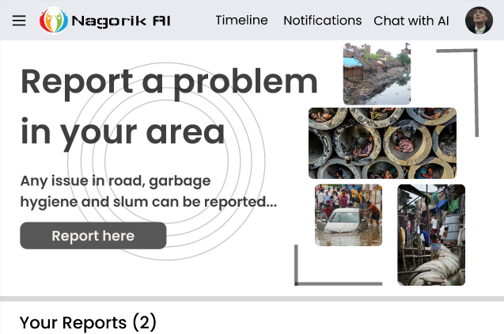

#  Nagorik-AI  
>### *An AI-Powered Civic Problem Reporting & Resolution Platform*

---

##  Project Overview

**Nagorik-AI** is a centralized web-based platform designed to collect, categorize, and resolve civic problems with the help of artificial intelligence and direct involvement of concerned authorities.

The platform also notifies users about any reported or ongoing civic issues in their locality, ensuring awareness and safety.

---

##  Objective

- Our goal is to bring all civic issues under one unified platform and ensure faster resolution through collaboration with responsible authorities.  
Nagorik-AI will also alert users whenever an issue arises in their locality so that they can stay informed.

---

##  Target Audience

People from all sectors can use this service, but our primary target audience is:

- **Youth citizens of the country**  
  As they are more technology-oriented, socially responsible, and actively concerned about the betterment of society.

---

##  Tech Stack

| Layer | Technology |
|------|----------|
| Backend | Laravel |
| Frontend | React |
| Rendering | Server-Side Rendering (SSR) |
| API Integration | AI APIs |
| Authentication | JWT (JSON Web Token) |

---

##  Core Features

 ###  AI-Powered Reporting
- AI categorizes user-reported problems automatically.
- AI Chatbot assists users in reporting and detecting civic issues.

###  Secure Authentication
- JWT-based authentication for the users to access the site..

###  Public Transparency
- All reported problems are publicly visible with real-time progress tracking.

###  Locality-Based Alerts
- Users near a verified problem location will receive instant notifications.

###  Authority Dashboard
- Admin panel for authorities to view categorized issues and manage resolutions.

###  CRAUD Operation
- ** Edit here **

###  RESTful API Endpoints
- ** Edit here **

---

##  Problem Domains Covered

- Road & traffic hazards  
- Water & drainage issues  
- Waste management  
- Streetlight & electricity problems  
- Public cleanliness & safety  

---

## UI Preview

[View Figma Design](https://www.figma.com/design/iU3c7MG6DvUrHk4a4jKzYt/Nagirik-AI?node-id=15-2&t=1zNYAsxyH9GtXJFl-1)

---

##  Milestones & Roadmap

| Phase | Description |
|-----|------------|
| Phase 1 | Landing page, Login, Registration & Home Page |
| Phase 2 | Database setup, Problem reporting & public listing |
| Phase 3 | Admin dashboard & emergency notification system |

---

## Team members

| Name           | Role           | Details         | ID           |
| -------------- | ------------------- | ------------------------------------ | -------------|
| Arnob          | Boss                | bossnocap@gmail.com | 20230104012    |
| Sajid Al Amin  | Lead                | dj12@gmail.com | 20230104025         |
| Rashedul Hasan | Front-end Developer | rashed@gmail.com | 20230104025       |
| Nafis Fuad     | Back-end Developer  | nafisfuadisc@gmail.com | 20230104025 |

---

##  Vision

> *To build a sicere society that are aware about their civic rights and prosper to a better society*

---